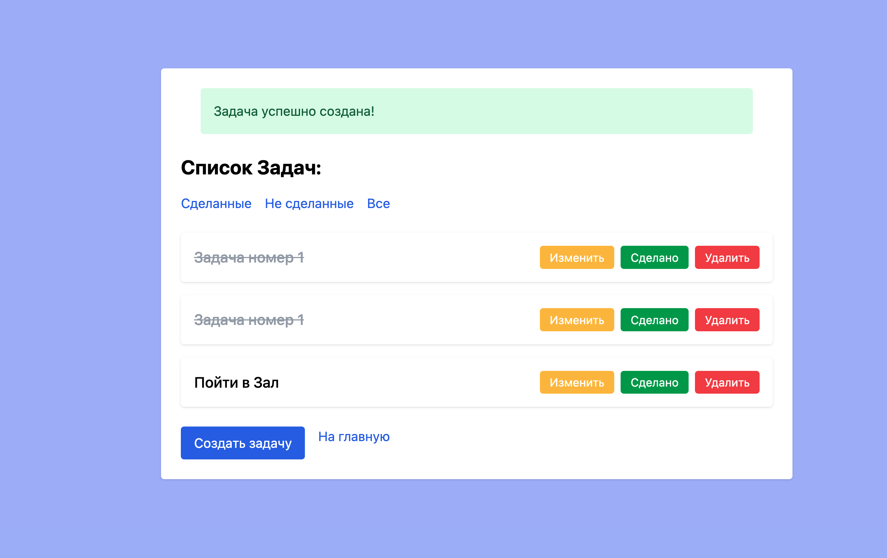
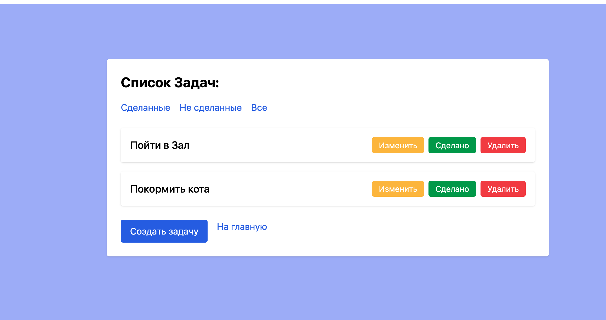

# ToDo App (Laravel 11 + Tailwind CSS)

Это простое приложение-менеджер задач, написанное на Laravel 11 с использованием Tailwind CSS для стилизации.

## ✨ Функциональность

- Добавление, редактирование и удаление задач
- Просмотр одной задачи
- Фильтрация по статусу: сделанные / не сделанные
- Пометка задач как выполненных
- Flash-сообщения
- Перечёркивание завершённых задач
- Tailwind UI

## 🚀 Технологии

- PHP 8.x
- Laravel 11
- Blade
- Tailwind CSS (через CDN)
- MySQL

## ⚙️ Установка

```bash
git clone https://github.com/Onotolius/ToDo-App.git
cd ToDo-App

composer install
cp .env.example .env
php artisan key:generate

# Настрой .env под свою базу данных

php artisan migrate
php artisan serve
```

## 🧪 Скриншоты

Примеры интерфейса можно посмотреть ниже


